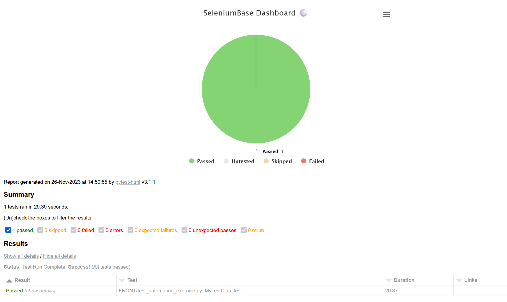
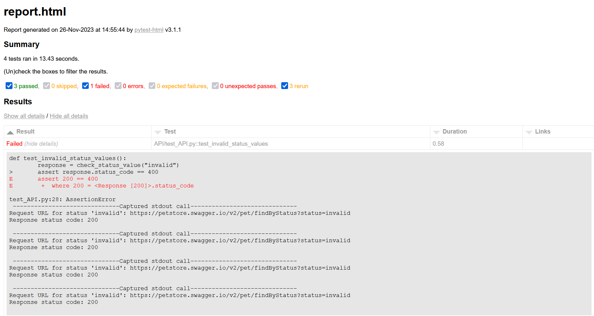

<h1>QA Engineer Exercise (Automation) | Nuvolar Works</h1>
Hi, these are the exercise results you asked for, my apologies for not using POM in the automation exercise, but I wanted to be as agile as possible.
<br>
<br>
Note: I have also added a small filter to the Amazon shop automation so that items without the quantity option are not listed. You can read all the answers and information in the readme.md repository. Last test for the API exercise fails on porpouse because other check status value works and shouldn't.
<br>
<br>
Kind regards.

--------

🔵 **1.1 Manual & Analysis Exercise**
<br>
Write the list of test cases for the given user story specifying per test case: description, steps and assertions. You can use any methodology you want (e.g. Gherkin).

```gherkin
Feature: User Account Creation

  Scenario: Successful User Registration
    Given the user is on the registration page
    When the user fills in valid information in all mandatory fields including:
      | Field                | Value                |
      | First Name           | John                 |
      | Last Name            | Doe                  |
      | Date of Birth        | 01/01/1990           |
      | Email                | john.doe@example.com |
      | Repeat Email         | john.doe@example.com |
      | Password             | securePassword123    |
      | Terms and Conditions | Checked              |
    And clicks on "Register"
    Then the user should be redirected to the activation page
    And an activation email should be sent to the provided email address

  Scenario: Existing Email Address
    Given the user is on the registration page
    And there is an existing account with the email address "existing@example.com"
    When the user enters the email address "existing@example.com"
    And clicks on "Register"
    Then the user should be redirected to the login page
    And a message should be displayed: "There is an existing account associated with existing@example.com"

  Scenario: Invalid Email Address
    Given the user is on the registration page
    When the user enters an invalid email address "invalid_email"
    And clicks on "Register"
    Then an error message should be displayed: "Invalid email."

  Scenario: Incomplete Registration Form
    Given the user is on the registration page
    When the user clicks on "Register" without filling in all mandatory fields
    Then error messages should be displayed for each missing field like: 
      """
      Please fill in this First Name
      Please fill in this Last Name
      Please fill in this Date of Birth
      Please fill in this Email
      Please fill in this Repeat Email
      Please fill in this Password
      Please fill in this Terms and Conditions
      """

  Scenario: Future Date of Birth
    Given the user is on the registration page
    When the user selects a date of birth exceeding the current date
    And clicks on "Register"
    Then an error message should be displayed: "Selected date exceeds the current date."

  Scenario: Account Activation in the Same Browser
    Given the user has completed the registration
    And the user is on the activation page
    When the user clicks on the activation link in the email in the same browser
    Then the user should be automatically logged into the system

  Scenario: Account Activation in a Different Browser
    Given the user has completed the registration
    And the user is on the activation page
    When the user clicks on the activation link in the email in a different browser
    Then the user should be redirected to the login page
    And a welcome message should be displayed
    And the email address should be pre-populated in the login form

  Scenario: Email Address Already Registered during Activation
    Given the user has completed the registration
    And the user is on the activation page
    And there is an existing account with the email address "existing@example.com"
    When the user clicks on the activation link in the email
    Then the user should be redirected to the login page
    And a message should be displayed: "There is an existing account associated with existing@example.com"
  
  Scenario: Registration with Password Below Minimum Length
    Given the user is on the registration page
    When the user enters a password with 5 characters
    And clicks on "Register"
    Then an error message should be displayed: "Password must be between 6 and 20 characters."

  Scenario: Registration with Password Above Maximum Length
    Given the user is on the registration page
    When the user enters a password with 21 characters
    And clicks on "Register"
    Then an error message should be displayed: "Password must be between 6 and 20 characters."

```

--------

🔵 **1.2 Manual & Analysis Exercise**
<br>
Write the list of test cases to cover the functionality of a pet store backend service Swagger UI, Pet section. https://petstore.swagger.io/#/ 

```
API Test Case Documentation
1. POST /pet: Add a new pet to the store

    Test Case 1: Add a new pet with valid data.
    Test Case 2: Attempt to add a new pet with missing required fields in the request body.

2. PUT /pet: Update an existing pet

    Test Case 1: Update an existing pet with valid data.
    Test Case 2: Attempt to update an existing pet with missing required fields in the request body.
    Test Case 3: Attempt to update a non-existing pet ID.

3. GET /pet/{petId}: Find pet by ID

    Test Case 1: Retrieve a pet with a valid pet ID.
    Test Case 2: Attempt to retrieve a pet with a non-existing pet ID.

4. DELETE /pet/{petId}: Delete a pet

    Test Case 1: Delete a pet with a valid pet ID.
    Test Case 2: Attempt to delete a pet with a non-existing pet ID.

5. POST /pet/{petId}/uploadImage: Upload an image for a pet

    Test Case 1: Upload an image for a pet with a valid pet ID and image file.
    Test Case 2: Attempt to upload an image for a non-existing pet ID.
    Test Case 3: Attempt to upload an image with an unsupported image format.

6. GET /pet/findByStatus: Find pets by status

    Test Case 1: Find pets with valid status values (available, pending, sold).
    Test Case 2: Attempt to find pets with invalid status values.

7. GET /pet/findByTags: Find pets by tags

    Test Case 1: Find pets with valid tags.
    Test Case 2: Attempt to find pets with invalid tags.

8. POST /pet/{petId}: Updates a pet in the store with form data

    Test Case 1: Update a pet with a valid pet ID and updated name and status.
    Test Case 2: Attempt to update a non-existing pet ID.

9. DELETE /pet/{petId}: Deletes a pet

    Test Case 1: Delete a pet with a valid pet ID.
    Test Case 2: Attempt to delete a pet with a non-existing pet ID.

10. GET /store/inventory: Returns pet inventories by status

    Test Case 1: Retrieve pet inventories with valid status values.
    Test Case 2: Attempt to retrieve pet inventories with invalid status values.
```

--------

🔵 **2 automation skills**
<br>
Analyze it and make any changes you may think of to make it clearer and more readable. Explain your changes. Create an automation test for the final scenario/s you defined using Selenium Webdriver and Java or whatever language you prefer. 

<h2>Note: Automation Exercise scenario modifications</h2>
<h3>Test Scenario: Purchase Hats on Amazon</h3>
```
Preconditions:

    Ensure a stable internet connection.
    Navigate to the Amazon website: https://www.amazon.com

Test Steps:

    Search for Men's Hats:
        Action: Go to the Amazon homepage.
        Action: Perform a search for "hats for men"

    Add Men's Hat to Cart:
        Action: Select the first hat from the search results.
        Action: Add the selected hat to the Cart with a quantity of 2.
        Expected Result: Confirm the addition by checking the Cart.

    Verify Men's Hat in Cart:
        Action: Open the Cart.
        Assertion: Verify that the total price and quantity for the selected men's hat are correct.

    Search for Women's Hats:
        Action: Return to the Amazon homepage.
        Action: Search for "hats for women."

    Add Women's Hat to Cart:
        Action: Choose the first hat from the search results.
        Action: Add the selected women's hat to the Cart with a quantity of 1.
        Expected Result: Confirm the addition by checking the Cart.

    Verify Women's Hat in Cart:
        Action: Open the Cart.
        Assertion: Verify that the total price and quantity for the selected women's hat are correct.

    Adjust Quantity of Men's Hat:
        Action: Go to the Cart.
        Action: Locate the men's hat added in step 2.
        Action: Change the quantity from 2 to 1.
        Expected Result: Confirm that the quantity is updated.

    Verify Adjusted Quantity and Price:
        Action: Open the Cart.
        Assertion: Ensure that the total price and quantity for the men's hat are updated correctly.

Note:

    This revised version provides a clearer flow of steps and includes explicit actions and expected results for each step.
    The use of headers for each step enhances the structure and readability.
    The terminology is consistent, making it easier to follow and understand.
    The URL is provided for easy reference to the Amazon homepage.
    
--------

<a id="basic_example_and_usage"></a>
<h2> Basic Example / Usage:</h2>

🔵 **How to install:**
Linux
```Bash
python -m pip install --upgrade pip
pip install -e . --upgrade --no-cache-dir --progress-bar=off
seleniumbase install chromedriver
```
🔵 **How to install:**
Windows
```Windows
py -m pip install --upgrade pip
pip install -e . --upgrade --no-cache-dir --progress-bar=off
seleniumbase install chromedriver
```

🔵 **Type ``seleniumbase`` or ``sbase`` to verify that SeleniumBase was installed successfully:**

<p align="left">Here's <a href="https://github.com/Othrondir/M-AExercise/blob/main/FRONT/test_automation.py">test_automation.py</a></p>

🔵 **How to run (Terminal):**

```bash
cd FRONT
pytest -v -ra test_automation.py --dashboard --html=report.html
 --junit-xml=report.xml --capture=tee-sys --cache-clear
```

```python
from seleniumbase import BaseCase
BaseCase.main(__name__, __file__)


class MyTestClas(BaseCase):
    def test(self):
        selectores = ['//*[@id="search"]/div[1]/div[1]/div/span[1]/div[1]/div[2]/div/div/div/div/span/div/div/div[1]/span/a/div/img', '//*[@id="newAccordionRow_1"]/div/div[1]/i']
        # Step 1: Go to https://www.amazon.com
        self.open("https://www.amazon.com/")
        # Step 2: Search for "hats for men" 
        self.type("input#twotabsearchtextbox", "hats for men\n")
        self.click_xpath('/html/body/div[1]/div[1]/span[2]/div/h1/div/div[4]/div/div/form/span/span/span/span')
        self.click_xpath('/html/body/div[4]/div/div/ul/li[2]/a')
        self.click_xpath('/html/body/div[1]/div[1]/div[1]/div[1]/div/span[1]/div[1]/div[2]/div/div/span/div/div/div[1]/span/a/div/img')
        # Step 3: Add first hat to Cart with quantity 2
        self.click_xpath('/html/body/div[1]/div[1]/div/div[7]/div[1]/div[2]/div[2]/div/div/div[2]/div[4]/div/div[1]/div/div/div/form/div/div/div/div/div[4]/div/div[10]/div/div/span/div/div/span/span/span')
        self.click("a#quantity_1")
        self.click("input#add-to-cart-button")                    
        # Step 4: Open cart and assert total price and quantity are correct
        self.click_xpath('//*[@id="sw-gtc"]/span/a')
        self.assert_text("Subtotal (2 items):", "#sc-subtotal-label-buybox")
        # Step 5: Search for "hats for women"
        self.type("input#twotabsearchtextbox", "hats for women\n")
        self.click_xpath('/html/body/div[1]/div[1]/span[2]/div/h1/div/div[4]/div/div/form/span/span/span/span')
        self.click_xpath('/html/body/div[4]/div/div/ul/li[2]/a')
        self.click_xpath('/html/body/div[1]/div[1]/div[1]/div[1]/div/span[1]/div[1]/div[2]/div/div/span/div/div/div[1]/span/a/div/img')
        # Step 6: Add first hat to Cart with quantity 1
        self.click("input#add-to-cart-button") 
        # Step 7: Open cart and assert total price and quantity are correct
        self.click_xpath('//*[@id="sw-gtc"]/span/a')
        self.assert_text("Subtotal (3 items):", "#sc-subtotal-label-buybox")
        # Step 8: Change the quantity for item selected at step 3 from 2 to 1 item in Cart
        self.click_xpath('/html/body/div[1]/div[1]/div[3]/div[4]/div/div[2]/div[1]/div/form/div[2]/div[4]/div[4]/div/div[2]/div[1]/span[1]/span/span[1]/span/span/span/span')
        self.click("a#quantity_1")
        # Step 9: Assert total price and quantity are changed correctly
        element_1 = self.find_element('/html/body/div[1]/div[1]/div[3]/div[4]/div/div[2]/div[1]/div/form/div[2]/div[3]/div[4]/div/div[2]/ul/div[1]/div/div[1]/div/span')
        element_2 = self.find_element('/html/body/div[1]/div[1]/div[3]/div[4]/div/div[2]/div[1]/div/form/div[2]/div[4]/div[4]/div/div[2]/ul/div[1]/div/div/div/span')
        number1 = float(element_1.text.replace('$', ''))
        number2 = float(element_2.text.replace('$', ''))
        sum = round(number1 + number2, 2)
        self.sleep(3)
        element_number_verification = self.find_element('//*[@id="sc-subtotal-amount-activecart"]')
        number_verification = float(element_number_verification.text.replace('$', ''))
        assert sum == number_verification, f"Total price ({sum}) changed incorrectly ({number_verification})"
        self.assert_text("Subtotal (2 items):", "#sc-subtotal-label-buybox")

```

<p align="left">Here's <a href="https://github.com/Othrondir/M-AExercise/blob/master/FRONT/report.html">report.html</a></p>
<p align="left">Here's <a href="https://github.com/Othrondir/M-AExercise/blob/master/FRONT/report.xml">report.xml</a></p>
<h2></h2>
It should be more detailed, but the current version of pytest has some problems with HTML reports, sorry!
--------

<a id="basic_example_and_usage"></a>
<h2> API Basic Example / Usage:</h2>

🔵 **2.2 Backend exercise Specification**
<br>
Create automation tests for the “pet/findPetsByStatus” endpoint for the Swagger UI application (Swagger UI ) you use before in the second manual and analysis exercise, following your own specifications and scenarios.

🔵 **How to install:**
Linux & Windows
```Linux
python -m pip install --upgrade pip
pip install -U pytest
pip install -U requests
```

🔵 **Type ``pytest --version`` to verify that pytest was installed successfully:**

<p align="left">Here's <a href="https://github.com/Othrondir/M-AExercise/blob/main/API/test_API.py">test_API.py</a></p>

🔵 **How to run (Terminal):**

```bash
cd API
pytest -v -ra test_API.py --reruns 3 --reruns-delay 3 --dashboard --html=report.html --junit-xml=report.xml --capture=tee-sys --cache-clear
```

    GET /pet/findByStatus: Find pets by status
        Test with valid status values (available, pending, sold).
        Test with invalid status values.

```python
import requests

ENDPOINT = "https://petstore.swagger.io/v2"

def check_status_value(status):
    params = {"status": status}
    response = requests.get(ENDPOINT + "/pet/findByStatus", params=params)

    print(f"Request URL for status '{status}':", response.url)
    print("Response status code:", response.status_code)

    return response

def test_available_status():
    response = check_status_value("available")
    assert response.status_code == 200

def test_pending_status():
    response = check_status_value("pending")
    assert response.status_code == 200

def test_sold_status():
    response = check_status_value("sold")
    assert response.status_code == 200

def test_invalid_status_value():
    response = check_status_value("invalid")
    assert response.status_code == 400
```

<p align="left">Here's <a href="https://github.com/Othrondir/M-AExercise/blob/mai/API/report.html">report.html</a>:</p>
<p align="left">Here's <a href="https://github.com/Othrondir/M-AExercise/blob/main/API/report.xml">report.xml</a>:</p>
<h2></h2>

<a id="that's all folks"></a>
<h2><img src="https://i.ytimg.com/vi/AYZz_qYw_j4/maxresdefault.jpg" 

--------
